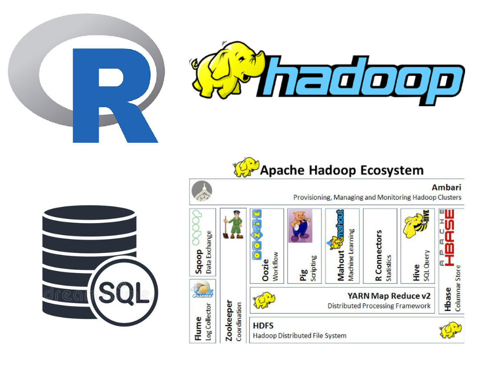

# Data Scientist Associate - Delivered by Dell EMC
### The tech stack covered in the course/certificate:
</img>
What you'll find in this repo is:
<ul>
  <li>R Basics</li>
  <li>Descriptive and Inferential Statistics</li>
  <li>Machine Learning Algorithms (K-Means, Linear Regression, Logistic Regression, Naive Bayes, Text Analysis, etc)</li>

### The rest of the content of this course/certificate was (you can find the PDF in this repo with the full content)
 <ul>
  <li>Hadoop: HDFS, Yarn, Map Reduce, Pig, Hive</li>
  <li>Advanced SQL (Transact-SQL, )</li>
